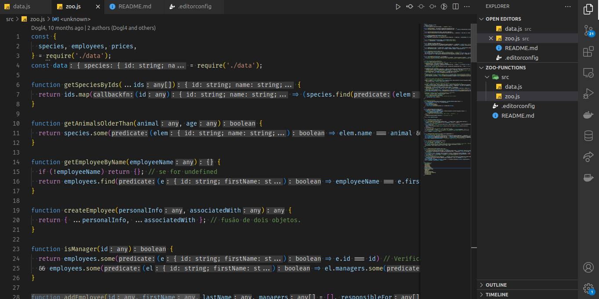

# Projeto Zoo Functions
## 📋 Descrição do projeto
Um projeto com várias funções, com a finalizade de gerenciar um zoológico. Neste projeto o principal objetivo é consolidar o conhecimento adquirido até o momento sobre manipulação de dados, objetos, arrays e funções na linguagem JavaScript.

## 📷 Screenshot

## 💻 Tecnologias utilizadas
- JavaScript

## 🎓 Aprendizados
- Produzir código legível, conciso e expressivo utilizando as novas funcionalidades do ES6
- Utilizar as _Higher Order Functions_ para manipular e criar arrays
- Escolher a _Higher Order Function_ mais adequada para a obtenção de um resultado esperado
- Aprender a usar de forma conjunta as _Higher Order Functions_
- Interpretar testes unitários e produzir soluções que atendam a eles

## 📚 Requisitos

### 1. IMPLEMENTE A FUNÇÃO getSpeciesByIds
  Esta função é responsável pela busca das espécies de animais por id. Ela retorna um array contendo as espécies referentes aos ids passados como parâmetro, podendo receber um ou mais ids.
  - Caso receba nenhum parâmetro, necessário retornar um array vazio
  - Ao receber como parâmetro um único id, retorna um array com a espécie referente à esse id
  - Ao receber mais de um id, retorna um array com as espécies referentes aos ids

### 2. IMPLEMENTE A FUNÇÃO getAnimalsOlderThan
  Esta função, a partir do nome de uma espécie e uma idade mínima, verifica se todos os animais daquela espécie possuem a idade mínima especificada
  - Deve retornar um valor booleano
  - Ao passar o nome de uma espécie e uma idade, testa se todos os animais desta
 espécie possuem a idade mínima especificada

### 3. IMPLEMENTE A FUNÇÃO getEmployeeByName
   Esta função é responsável pela busca das pessoas colaboradoras através do primeiro ou do último nome delas
  - Sem parâmetros, retorna um objeto vazio
  - Quando provido o primeiro nome do funcionário, retorna o objeto do funcionário
  - Quando provido o último nome do funcionário, retorna o objeto do funcionário

### 4. IMPLEMENTE A FUNÇÃO createEmployee
  A função, a partir de informações recebidas nos parâmetros, é capaz de criar um objeto equivalente ao de uma pessoa colaboradora, retornando-o
  - O parâmetro `personalInfo` recebe um objeto que contém o `id`, o `firstName` e o `lastName`
  - O parâmetro `associatedWith` recebe um objeto que contém dois array: `managers` e `responsibleFor`
  - Cria um novo colaborador a partir de objetos contendo `informações pessoais` e `gerentes e animais gerenciados`.

### 5. IMPLEMENTE A FUNÇÃO isManager
  Verifica se uma pessoa colaboradora, a partir de seu id, ocupa cargo de gerência.
  - Deve retornar um valor booleano
  - Testa se o id passado é de um gerente

### 6. IMPLEMENTE A FUNÇÃO addEmployee
  A função irá adicionar uma nova pessoa colaboradora ao array `employees`, presente no arquivo `data.js`.
  - Adiciona um funcionário no fim da lista

### 7. IMPLEMENTE A FUNÇÃO countAnimals
  Esta função é responsável por contabilizar a quantidade de animais.
  - Sem parâmetros, retorna um objeto
  - Com o nome de uma espécie de animal, retorna um número
  - Sem parâmetros, retorna animais e suas quantidades
  - Com o nome de uma espécie de animal, retorna somente a quantidade

### 8. IMPLEMENTE A FUNÇÃO calculateEntry
  A partir da quantidade de visitantes e a faixa etária de cada um, esta função é responsável por retornar o preço total a ser cobrado
  - O parâmetro `entrants` recebe um objeto que contém as chaves `Adult`, `Child` e `Senior`, com suas respectivas quantidades de pessoas
  - Retorna 0 se nenhum argumento for passado
  - Retorna 0 se um objeto vazio for passado
  - Retorna o preço total a ser cobrado dado o número de adultos, crianças e idosos

### 9. IMPLEMENTE A FUNÇÃO getAnimalMap
  A função é responsável pelo mapeamento geográfico das espécies e seus animais, podendo ainda filtrá-los por ordem alfabética e gênero, por exemplo
  - Analise o teste unitário para entender os retornos que são esperados para esta função
  - Sem parâmetros, retorna animais categorizados por localização
  - Com a opção `includeNames: true` especificada, retorna nomes de animais
  - Com a opção `sorted: true` especificada, retorna nomes de animais ordenados
  - Com a opção `sex: 'female'` ou `sex: 'male'` especificada, retorna somente nomes de animais macho/fêmea
  - Com a opção `sex: 'female'` ou `sex: 'male'` especificada e a opção `sort: true` especificada, retorna somente nomes de animais macho/fêmea com os nomes dos animais ordenados
  - Só retorna informações ordenadas e com sexo se a opção `includeNames: true` for especificada

### 10. IMPLEMENTE A FUNÇÃO getSchedule
  A função é responsável por disponibilizar as informações de horário para uma consulta, que pode querer ter acesso a todo o cronograma da semana ou apenas o cronograma de um dia específico
  - Analise o teste unitário para entender os retornos que são esperados para esta função
  - Sem parâmetros, retorna um cronograma legível para humanos
  - Se um único dia for passado, retorna somente este dia em um formato legível para humanos

### 11. IMPLEMENTE A FUNÇÃO getOldestFromFirstSpecies
  A função busca por informações do animal mais velho da primeira espécie gerenciada pela pessoa colaboradora do parâmetro
  - Passado o id de um funcionário, encontra a primeira espécie de animal
  gerenciado pelo funcionário, e retorna um array com nome, sexo e idade do
  animal mais velho dessa espécie

### 12. IMPLEMENTE A FUNÇÃO increasePrices
  A função é responsável por aumentar o preço das visitas, com base no valor de aumento recebido no parâmetro, em porcentagem
  - Se o parâmetro da função recebe o valor 20, o aumento é de 20%
  - Altera o objeto `prices` do arquivo `data.js`
  - Ao passar uma porcentagem, incrementa todos os preços, arrendondados em duas casas decimais

### 13. IMPLEMENTE A FUNÇÃO getEmployeeCoverage
  A função é responsável por consultar as espécies pela qual a pessoa colaborada, recebida no parâmetro através de seu `id`, `firstName` ou `lastName`, é responsável
  - Analise o teste unitário para entender os retornos que são esperados para esta função
  - Sem parâmetros, retorna uma lista de funcionários e os animais pelos quais eles são responsáveis
  - Com o id de um funcionário, retorna os animais pelos quais o funcionário é responsável
  - Com o primeiro nome de um funcionário, retorna os animais pelos quais o funcionário é responsável
  - Com o último nome de um funcionário, retorna os animais pelos quais o funcionário é responsável

## 📈 Status do projeto
✅ Concluído

## :busts_in_silhouette: Contribuintes
<table>

<tr  style="width:120px">

<td  align="center">

<a  target=”_blank”  href="https://github.com/Dogl4">

 

<b>Pedro Barreto</b>

</a>

</td>

</tr>

</table>
